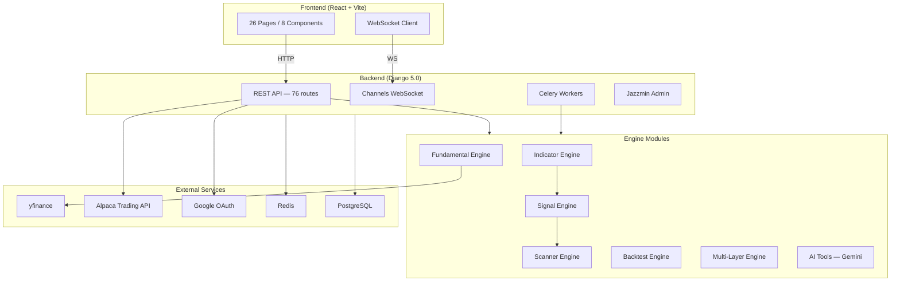
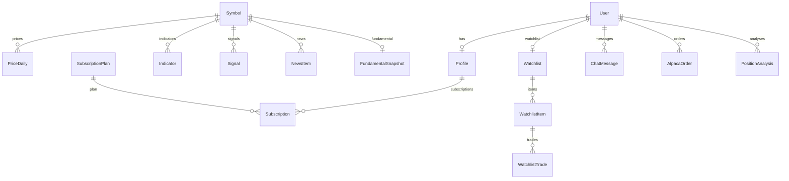

# 📡 StockRadar — System Review

## สรุปภาพรวม

StockRadar เป็นแพลตฟอร์มวิเคราะห์หุ้นแบบครบวงจร รองรับทั้งตลาด SET (ไทย) และ US (NASDAQ/NYSE) พัฒนาด้วย Django 5.0 (Backend) + React/TypeScript/Vite (Frontend) พร้อม real-time WebSocket, AI Chat, และระบบเทรดจริงผ่าน Alpaca

---

## 🏗️ สถาปัตยกรรม

---

## 📊 Tech Stack

| Layer | เทคโนโลยี |
|---|---|
| **Backend** | Django 5.0, DRF 3.14, Daphne (ASGI), Channels 4.0 |
| **Frontend** | React 18.3, TypeScript, Vite 5.4, Lightweight Charts |
| **Database** | SQLite (dev) / PostgreSQL (prod) |
| **Cache/Broker** | Redis (prod), LocMem (dev) |
| **Task Queue** | Celery 5.3 + django-celery-beat |
| **Auth** | django-allauth (Google OAuth) + DRF Token Auth |
| **Admin UI** | Jazzmin (Darkly theme) |
| **AI** | Google Gemini via google-genai |
| **Trading** | Alpaca Markets API |
| **Static Files** | WhiteNoise |

---

## 📁 โครงสร้างโมดูล

### Backend — `radar/` (47 ไฟล์)

| ไฟล์ | ขนาด | บทบาท |
|---|---|---|
| `views/` | (Directory) | **แยกส่วนแล้ว** (13 ไฟล์ย่อยแบ่งตาม Feature Domain) |
| `models.py` | 55 KB | 16+ Models (914 บรรทัด) |
| `ai_tools.py` | 44 KB | AI Chat + Function Calling (Gemini) |
| `multilayer_engine.py` | 29 KB | Multi-layer analysis scanner |
| `scanner_engine.py` | 24 KB | Signal scanner engine (vectorized) |
| `indicator_cache.py` | 23 KB | Redis cache layer สำหรับ indicators |
| `backtest_engine.py` | 21 KB | Strategy backtesting |
| `admin.py` | 18 KB | Admin panel UI customization |
| `tasks.py` | 19 KB | Celery background tasks |
| `market_fetcher.py` | 18 KB | ดึงราคาจาก yfinance |
| `indicator_engine.py` | 16 KB | คำนวณ Technical Indicators |
| `signal_engine.py` | 10 KB | Signal generation logic |
| `alpaca_service.py` | 10 KB | Alpaca trading integration |
| `news_fetcher.py` | 9 KB | RSS news fetcher + sentiment |
| `fundamental_engine.py` | 8 KB | VI screener (Yahoo Finance) |

### Frontend — `frontend/src/pages/` (26 หน้า)

| หน้า | ขนาด | ฟีเจอร์ |
|---|---|---|
| `Guide.tsx` | 59 KB | คู่มือการใช้งาน |
| `LandingPage.tsx` | 52 KB | หน้าแรก |
| `Watchlist.tsx` | 36 KB | Portfolio + การซื้อขาย |
| `StrategyBuilder.tsx` | 30 KB | สร้างกลยุทธ์ custom |
| `Backtest.tsx` | 27 KB | ทดสอบกลยุทธ์ย้อนหลัง |
| `MultiLayerScanner.tsx` | 24 KB | Scanner หลายชั้น |
| `Scanner.tsx` | 23 KB | Signal scanner |
| `Chart.tsx` | 23 KB | กราฟราคา + indicators |
| `News.tsx` | 22 KB | ข่าว + sentiment |
| `EngineScan.tsx` | 21 KB | Engine-level scan |
| `Fundamental.tsx` | 21 KB | ข้อมูล fundamental |
| `Profile.tsx` | 20 KB | โปรไฟล์ผู้ใช้ |
| `Chat.tsx` | 19 KB | AI Chat |
| `VIScreen.tsx` | 18 KB | VI screening |
| `Dashboard.tsx` | 18 KB | Dashboard สรุปสัญญาณ |

---

## 🗂️ Database Models (16+ Models)

---

## ✅ จุดเด่นของระบบ

### 1. ระบบ Engine แยกส่วนชัดเจน
- **Indicator Engine** → คำนวณ EMA, RSI, MACD, Bollinger, ATR, ADX
- **Signal Engine** → สร้างสัญญาณ BUY/SELL จาก indicators
- **Scanner Engine** → สแกนหุ้นทั้งตลาดแบบ vectorized (ใช้ pandas)
- **Backtest Engine** → ทดสอบกลยุทธ์ย้อนหลัง
- **Multi-Layer Engine** → วิเคราะห์ 6 ชั้น (Technical + Fundamental + Volume + Momentum + Risk + Sentiment)

### 2. Subscription / Tier System
- 3 ระดับ: FREE → PRO → PREMIUM พร้อม tier limits ที่ควบคุม watchlist, backtest years, scanner top
- `Subscription` model ซิงค์ tier อัตโนมัติเมื่อ save

### 3. ระบบ Cache ที่ดี
- `indicator_cache.py` (23 KB) ใช้ Redis cache แยกต่างหากสำหรับ indicators
- API-level caching ที่หลายจุดใน views

### 4. Admin Panel คุณภาพ
- Jazzmin UI พร้อม custom badges (tier, status, Google, portfolio)
- Chat Inbox view แบบ user-centric
- Actions: activate/expire subscriptions
- Singleton patterns สำหรับ BusinessProfile, SiteSetting

### 5. AI Integration
- Google Gemini (google-genai) สำหรับ AI Chat + stock analysis
- AI reasoning ใน Alpaca orders
- Daily usage limit ที่ configurable

### 6. Real-time Features
- Django Channels + WebSocket สำหรับ scanner results broadcast
- Price poller + Ticker tape

---

## ⚠️ จุดที่ควรปรับปรุง

### 🔴 Critical

| # | ปัญหา | รายละเอียด | สถานะ |
|---|---|---|---|
| 1 | **`views.py` ใหญ่เกินไป** | แยกออกเป็น modules ย่อยใน `radar/views/` | **✅ แก้ไขแล้ว** |
| 2 | **`db.sqlite3` ขนาด 240 MB** | อยู่ใน repo directory — ควรอยู่ใน `.gitignore` | **✅ แก้ไขแล้ว** |
| 3 | **ไม่มี Unit Tests** | `tests.py` ว่างเปล่า — ไม่มี test coverage | **✅ แก้ไขแล้ว** |

### 🟡 Important

| # | ปัญหา | รายละเอียด |
|---|---|---|
| 4 | **`save_user_profile` signal อาจทำให้เกิด infinite loop** | `post_save` signal ที่เรียก `instance.profile.save()` อาจ trigger save ซ้ำ |
| 5 | **Frontend ไม่ใช้ routing library** | ทั้ง 26 หน้าอยู่ใน `App.tsx` โดยไม่ใช้ React Router — ทำให้ deep linking/SEO ไม่ทำงาน |
| 6 | **ไม่มี pagination ใน PriceListView / IndicatorListView** | `pagination_class = None` อาจส่งข้อมูลหลายพัน rows ต่อ request |
| 7 | **SignalListView ใช้ Python-level dedup** | วนลูปทุก signal ใน Python แทนที่จะ dedup ที่ DB level — ช้าเมื่อมีข้อมูลเยอะ |
| 8 | **Scratch/debug files ใน root directory** | `check_*.py`, `diagnose*.py`, `fix_*.py`, `test_*.py` กระจายอยู่ใน root — ควรจัดเข้า `scripts/` |

### 🟢 Nice to Have

| # | ข้อเสนอ | รายละเอียด |
|---|---|---|
| 9 | **API versioning** | ยังไม่มี `/api/v1/` — ถ้าต้อง breaking change จะยาก |
| 10 | **Docker/docker-compose** | ยังไม่มี `Dockerfile` — มีเฉพาะ shell scripts สำหรับ VPS deploy |
| 11 | **Logging ที่เป็นระบบ** | ยังไม่มี Django LOGGING config ใน settings |
| 12 | **Frontend dependencies น้อย** | ใช้แค่ React + Lightweight Charts — อาจต้องการ state management (Zustand/Redux) |

---

## 🔢 สถิติระบบ

| Metric | ค่า |
|---|---|
| Backend Python Files | ~140 ไฟล์ (+13 files จากการแยก views) |
| Frontend Pages | 26 หน้า |
| API Endpoints | 76 routes |
| Database Models | 16+ models |
| Backend Code (radar/) | ~550 KB |
| Frontend Code (src/) | ~550 KB |
| Dependencies (pip) | 20+ packages |
| Dependencies (npm) | React 18 + Vite 5 |

---

## 📝 สรุป

StockRadar เป็นระบบที่มีฟีเจอร์ครบถ้วนสำหรับการวิเคราะห์หุ้น ปัจจุบันได้ดำเนินการปรับปรุงโครงสร้าง **Views Layer** ให้เป็นระเบียบและง่ายต่อการดูแลรักษามากขึ้น โดยแยกฟีเจอร์ต่างๆ ออกเป็นโมดูลย่อยตามโดเมนงาน

ขั้นตอนต่อไปที่แนะนำคือการจัดการกับ **Unit Tests** เพื่อความมั่นคงของระบบ และการย้ายไฟล์ Database ออกจาก repo directory
